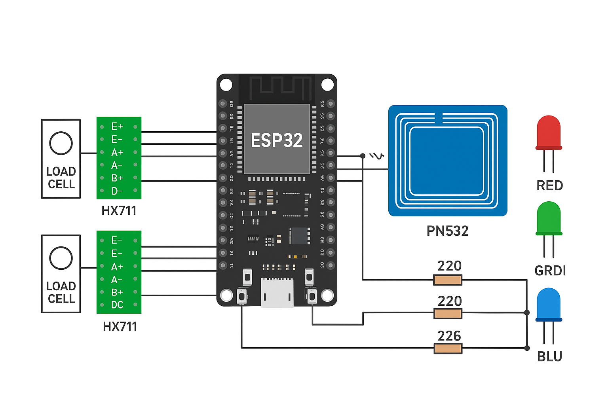

# Smart Inventory Pallet – Embedded System for Inventory Automation

An embedded IoT solution to automate vehicle loading and unloading operations in beverage distribution warehouses. This system uses **ESP32**, **load cells**, and **cloud-based SaaS integration** to **eliminate manual stock entry** and update inventory in real-time.

---

## 📌 Problem Statement

In beverage distribution agencies, warehouse clerks manually record:
- Stock **loaded** into delivery vehicles
- Stock **unloaded** back into the warehouse

This manual process:
- Is prone to human error
- Delays reporting
- Requires daily reconciliation

---

## 🎯 Project Objective

> Replace manual stock tracking with **Smart Inventory Pallets** that:
> - Detect loading/unloading based on **weight change**
> - Connect with a **SaaS inventory platform**
> - Automate sales reporting and stock updates

---

## 🧠 System Overview

### 🔹 Components

- **Load Cell** to detect weight changes on pallet
- **HX711** to amplify analog signal from load cell
- **ESP32** to read data and transmit to cloud via Wi-Fi
- **SaaS Platform** to receive, process, and report inventory data

### 📊 System Architecture


1. Crates placed/removed from pallet
2. Load cell detects weight changes
3. ESP32 calculates Δweight and sends data
4. SaaS platform:
   - Updates vehicle/warehouse stock
   - Generates daily reports

---

## 🔌 Hardware Setup

| Component              | Description                             |
|------------------------|-----------------------------------------|
| **Load Cell**          | Measures weight (5kg–20kg)            |
| **HX711 Amplifier**    | Converts analog signal to digital       |
| **ESP32 Dev Board**    | Microcontroller with Wi-Fi              |
| **Power Supply**       | Battery/USB power for ESP32             |
| **Wooden/Plastic Pallet** | Holds crates during loading/unloading |

### 🧱 Hardware Wiring Diagram



- Load Cell → HX711 → ESP32
- ESP32 → SaaS via Wi-Fi
- Powered via USB/Battery

---

## ⚙️ Firmware

### ✅ Features

- Read live weight using HX711
- Detect **loading/unloading events**
- Send `POST` request to SaaS API with:
  - `pallet_id`
  - `timestamp`
  - `delta_weight`
  - `event` type (`load` or `unload`)


---
---

## 📅 Project Timeline – 12 Weeks

| Week | Milestone                                      | Description                                                                 |
|------|------------------------------------------------|-----------------------------------------------------------------------------|
| 1    | **Requirement Analysis & Planning**         | Finalize features, hardware list, and system architecture. Set up GitHub repo. |
| 2    | **Research & Design**                       | Study ESP32 + HX711 + load cell integration. Finalize API structure.       |
| 3    | **Prototype Circuit Build**                 | Connect ESP32, HX711, and load cell on breadboard. Begin firmware development. |
| 4    | **Firmware Development I**                  | Implement weight reading, filtering, and Δweight detection logic.          |
| 5    | **API Integration**                         | Send data from ESP32 to mock SaaS API using HTTP POST (or MQTT).           |

---
## 🌐 SaaS Integration

With existing SaaS platform should expose a **REST API** or **MQTT broker**.

### 📥 Sample API Payload

```json
{
  "pallet_id": "P001",
  "timestamp": "2025-07-21T14:30:00",
  "event": "load",
  "delta_weight": 60.0
}
